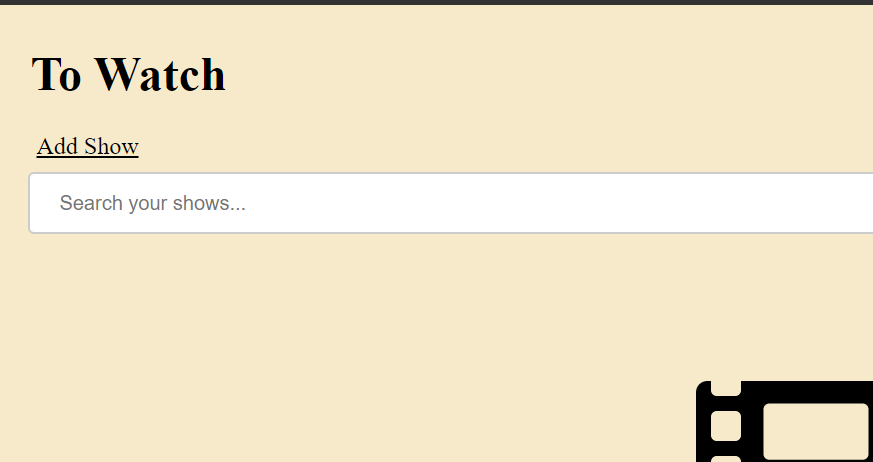
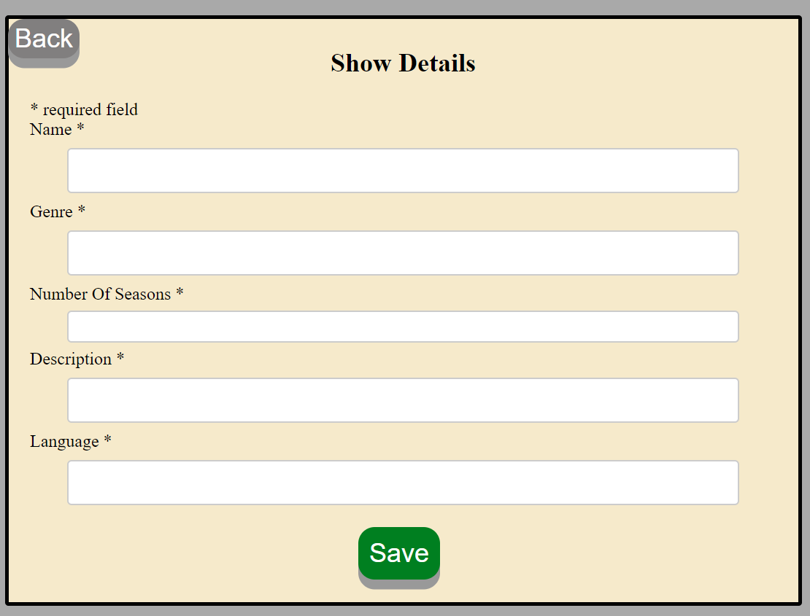
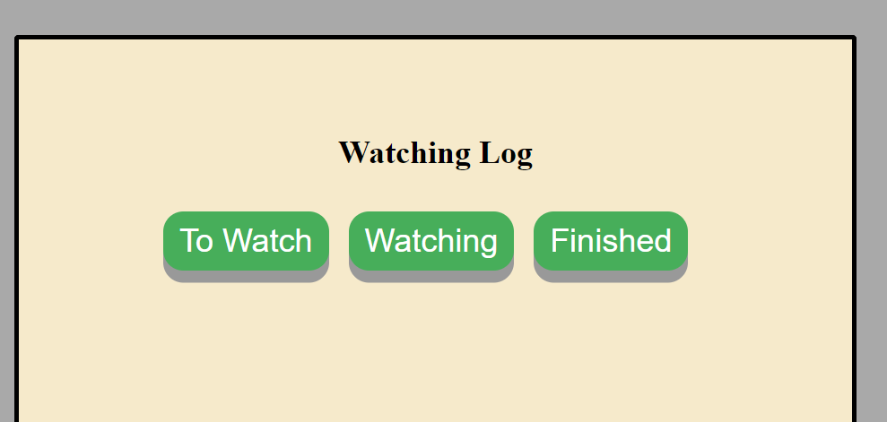
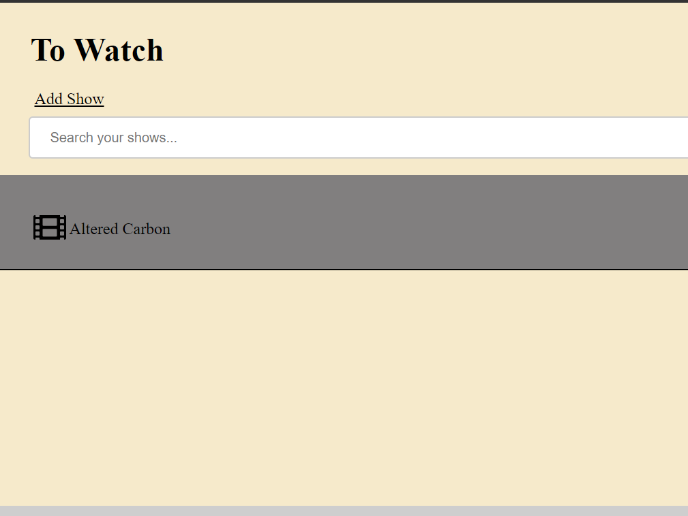
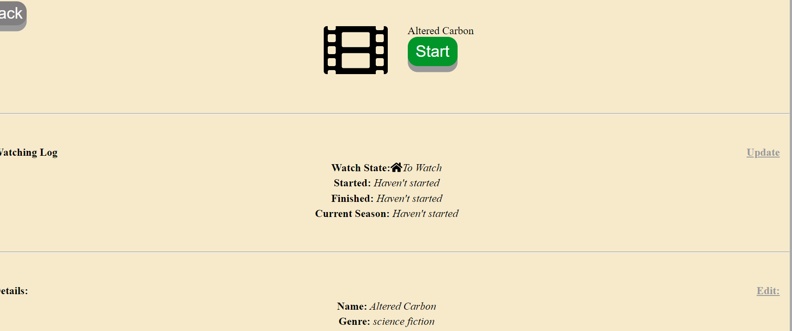
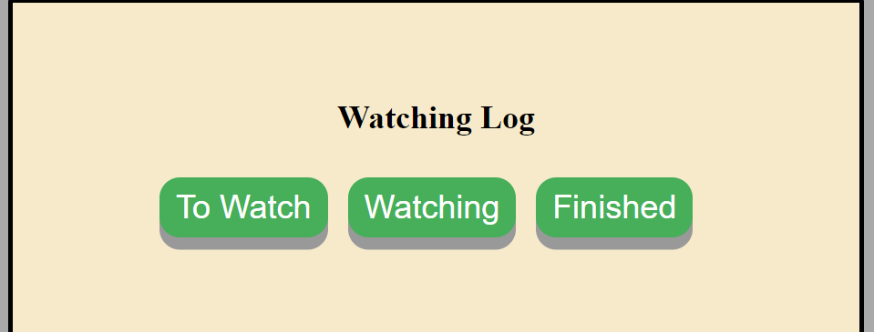
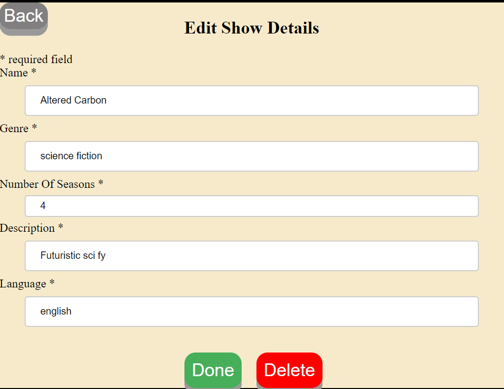
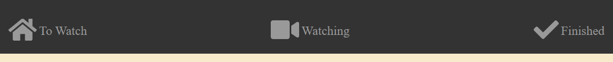

Name of app: ShowApp

Link to app: https://bookmarks-app.allanhfcheng.now.sh/

Description of App:

This app allows the user to add shows they plan to watch, currently watching, and shows they have already watched.   This is represented in the three tabs: To Watch, Watching, and Finished.  

A show can be moved to these three states.  Each show has the following:

Title,
Genre,
Number of Seasons,
Description,
Language of show.

A show in the Watching state has a start date and a current season
A show in the Finished state has a finished date.

In each tab (To Watch, Watching, Finished), you can search for the shows in that state.

App Screenshots and instructions:

At the app homescreen click on Add Show.

Enter show details and click save.

Select the show's state.

You now have the show listed under the state you set it to (To Watch, Watching Finished)

Click on a show to enter show Information page

On the same page as the previous step (Information page) click on "Update" or "Edit"
Update allows you to change state of show.
Edit allows you to edit show details

The Nav at the top allows you to look at shows in different states.

Technology used:
React, Javascript, Css, Html, Node, Postgres.

